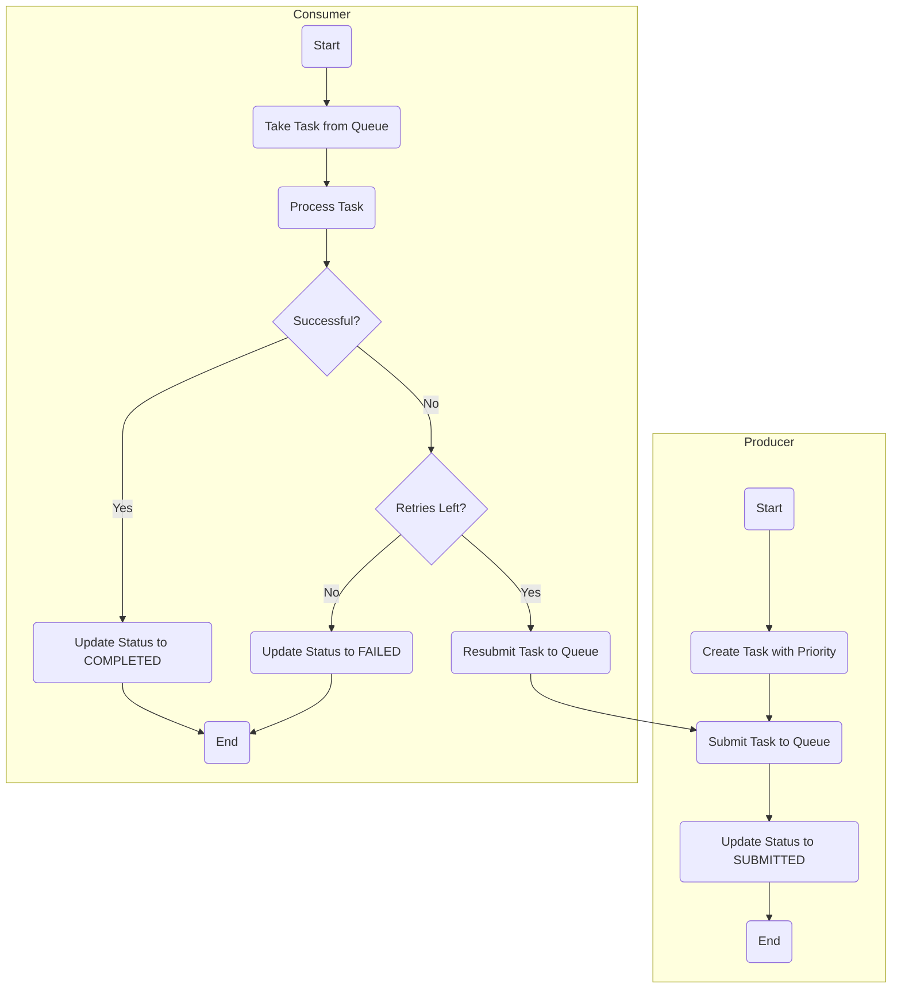

# Concurrent Task Queue

This project implements a concurrent task processing system in Java. It demonstrates the use of producers, consumers, a priority task queue, and a monitoring system to handle tasks asynchronously.

## Features

- **Producer-Consumer Pattern**: Multiple producers generate tasks, and a pool of consumers process them concurrently.
- **Priority-Based Processing**: Tasks are processed based on a priority system, where tasks with higher priority are executed first.
- **Task Retries**: Failed tasks are automatically retried up to a configurable maximum number of attempts.
- **Status Tracking**: The status of each task (`SUBMITTED`, `PROCESSING`, `COMPLETED`, `FAILED`) is tracked throughout its lifecycle.
- **Monitoring**: A dedicated monitoring thread provides real-time statistics about the system, including queue size, active threads, and task status counts.
- **Graceful Shutdown**: The application performs a graceful shutdown, ensuring that tasks are not lost when the application terminates.
- **JSON Export**: Task statuses are periodically exported to a `task_statuses.json` file for external monitoring and analysis.

## Project Structure

The project is organized into the following main packages:

- `com.ndungutse.producer`: Contains the `TaskProducer` class, responsible for creating and submitting tasks.
- `com.ndungutse.consumer`: Contains the `TaskConsumer` class, responsible for processing tasks from the queue.
- `com.ndungutse.queue`: Contains the `TaskQueue` class, which is a priority-based blocking queue for tasks.
- `com.ndungutse.model`: Contains the data models `Task` and `TaskStatus`.
- `com.ndungutse.tracker`: Contains classes for monitoring and tracking task statistics and statuses (`MonitorThread`, `TaskStats`, `TaskStatusTracker`).

## Concurrent Task Dispatch Workflow

The following diagram illustrates the workflow of a task from creation to completion:



## How to Run

1.  **Prerequisites**:

    - Java Development Kit (JDK) 11 or higher.
    - Apache Maven.

2.  **Build the project**:

    ```bash
    mvn clean install
    ```

3.  **Run the application**:

    ```bash
    java -jar target/concurqueue-1.0-SNAPSHOT.jar
    ```

    (Note: The exact jar file name may vary depending on the project version in `pom.xml`)

    Alternatively, you can run the `Main` class from your IDE.

## Output

The application will log information about task production, consumption, and monitoring to the console.

Additionally, a `task_statuses.json` file will be created in the root of the project directory, containing the latest status of all processed tasks. This file is updated periodically by the monitor thread.
